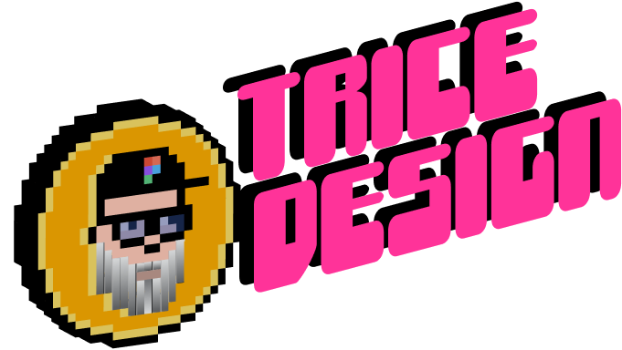

# Trice Design Portfolio

<div align="center">
  
</div>

A modern, responsive portfolio website built with Next.js 14, showcasing my work as a Product Designer and Creative Engineer.

## Features

- 🎨 Bold, maximalist design with dynamic visuals
- ⚡️ Built with Next.js 14 and React
- 📱 Fully responsive
- 🎭 Custom animations and transitions
- 🌟 Interactive 3D elements with Three.js
- 🎯 Case studies and project showcases
- 🔍 SEO optimized

## Tech Stack

- Next.js 14
- React
- TypeScript
- Three.js / React Three Fiber
- CSS Modules
- GSAP for animations

## Getting Started

First, install the dependencies:

```bash
npm install
# or
yarn install
```

Then, run the development server:

```bash
npm run dev
# or
yarn dev
```

Open [http://localhost:3000](http://localhost:3000) with your browser to see the result.

## Project Structure

```
├── app/                  # Next.js 14 app directory
├── components/          # React components
│   ├── sections/       # Page sections
│   └── ui-components/  # Reusable UI components
├── public/             # Static assets
└── styles/            # Global styles and CSS modules
```

## Learn More About Next.js

To learn more about Next.js, take a look at the following resources:

- [Next.js Documentation](https://nextjs.org/docs) - learn about Next.js features and API.
- [Learn Next.js](https://nextjs.org/learn) - an interactive Next.js tutorial.

## Deployment

This site is deployed on Vercel. For more information about deploying Next.js apps, check out the [Next.js deployment documentation](https://nextjs.org/docs/app/building-your-application/deploying).

## License

This project is licensed under the MIT License.
